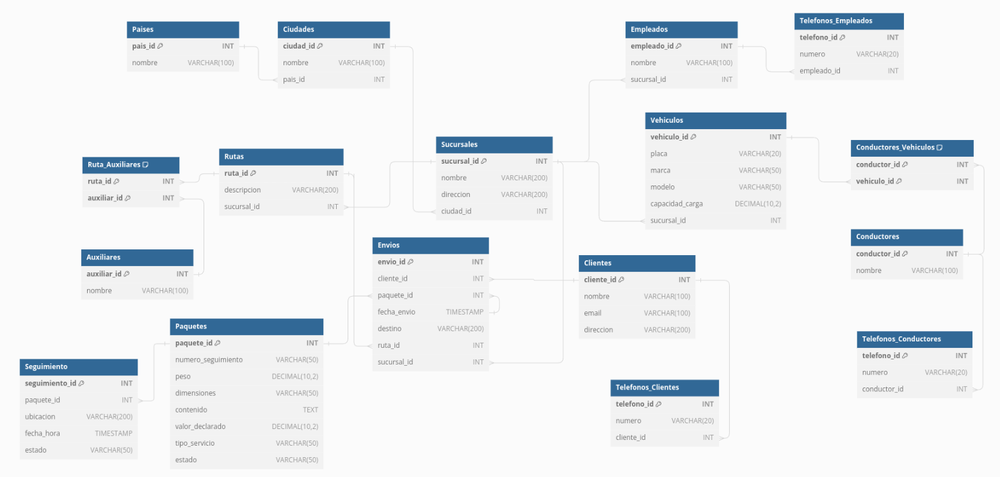

CASOS DE USO

    1: Registrar un Nuevo País
INSERT INTO Paises (pais_id, nombre) VALUES (1, 'Nombre_País');

    2: Registrar una Nueva Ciudad
INSERT INTO Ciudades (ciudad_id, nombre, pais_id) VALUES (1, 'Nombre_Ciudad', 1);

    3: Registrar una Nueva Sucursal
INSERT INTO Sucursales (sucursal_id, nombre, direccion, ciudad_id) VALUES (1, 'Nombre_Sucursal', 'Direc_Sucursal', 1);

    4: Registrar un Nuevo Cliente
INSERT INTO Clientes (cliente_id, nombre, email, direccion) VALUES (1, 'Nombre_Cliente', 'email@cliente.com', 'Direc_Cliente');

    5: Registrar un Nuevo Teléfono para un Cliente
INSERT INTO Telefonos_Clientes (telefono_id, numero, cliente_id) VALUES (1, 'Numero_Telefono', 1);

    6: Registrar un Nuevo Paquete
INSERT INTO Paquetes (paquete_id, numero_seguimiento, peso, dimensiones, contenido, valor_declarado, tipo_servicio, estado) VALUES (1, 'Numero_Seguimiento', 10.5, '30x30x30', 'Contenido_Paquete', 100.0, 'Tipo_Servicio', 'Estado');

    7: Registrar un Nuevo Envío
INSERT INTO Envios (envio_id, cliente_id, paquete_id, fecha_envio, destino, ruta_id, sucursal_id) VALUES (1, 1, 1, '2024-01-01 10:00:00', 'Destino_Envío', 1, 1);

    8: Registrar un Nuevo Vehículo
INSERT INTO Vehiculos (vehiculo_id, placa, marca, modelo, capacidad_carga, sucursal_id) VALUES (1, 'Placa_Vehiculo', 'Marca_Vehiculo', 'Modelo_Vehiculo', 5000.0, 1);

    9: Registrar un Nuevo Conductor
INSERT INTO Conductores (conductor_id, nombre) VALUES (1, 'Nombre_Conductor');

    10: Registrar un Nuevo Teléfono para un Conductor
INSERT INTO Telefonos_Conductores (telefono_id, numero, conductor_id) VALUES (1, 'Numero_Telefono', 1);

    11: Asignar un Conductor a una Ruta y un Vehículo
INSERT INTO Conductores_Vehiculos (conductor_id, vehiculo_id) VALUES (1, 1);

    12: Registrar un Nuevo Auxiliar
INSERT INTO Auxiliares (auxiliar_id, nombre) VALUES (1, 'Nombre_Auxiliar');

    13: Asignar un Auxiliar a una Ruta
INSERT INTO Ruta_Auxiliares (ruta_id, auxiliar_id) VALUES (1, 1);

    14: Registrar un Evento de Seguimiento para un Paquete
INSERT INTO Seguimiento (seguimiento_id, paquete_id, ubicacion, fecha_hora, estado) VALUES (1, 1, 'Ubicación', '2024-01-01 10:00:00', 'Estado');

    15: Generar un Reporte de Envíos por Cliente
SELECT e.envio_id, e.fecha_envio, p.numero_seguimiento, p.estado, e.destino, r.descripcion AS ruta, s.nombre AS sucursal
FROM Envios e
JOIN Paquetes p ON e.paquete_id = p.paquete_id
JOIN Rutas r ON e.ruta_id = r.ruta_id
JOIN Sucursales s ON e.sucursal_id = s.sucursal_id
WHERE e.cliente_id = 1;

    16: Actualizar el Estado de un Paquete
UPDATE Paquetes SET estado = 'Nuevo_Estado' WHERE paquete_id = 1;

    17: Rastrear la Ubicación Actual de un Paquete
SELECT ubicacion, fecha_hora, estado 
FROM Seguimiento 
WHERE paquete_id = 1 
ORDER BY fecha_hora DESC 
LIMIT 1;

    1: Obtener Información Completa de Envíos --------
SELECT e.envio_id, e.fecha_envio, e.destino, c.nombre AS cliente, p.numero_seguimiento, p.estado AS estado_paquete, r.descripcion AS ruta, s.nombre AS sucursal, v.placa AS vehiculo, d.nombre AS conductor
FROM Envios e
JOIN Clientes c ON e.cliente_id = c.cliente_id
JOIN Paquetes p ON e.paquete_id = p.paquete_id
JOIN Rutas r ON e.ruta_id = r.ruta_id
JOIN Sucursales s ON e.sucursal_id = s.sucursal_id
JOIN Conductores_Vehiculos cv ON cv.vehiculo_id = v.vehiculo_id
JOIN Conductores d ON cv.conductor_id = d.conductor_id;

    2: Obtener Historial de Envíos de un Cliente
SELECT e.envio_id, e.fecha_envio, p.numero_seguimiento, p.estado AS estado_paquete, s.fecha_hora, s.ubicacion, s.estado AS estado_seguimiento
FROM Envios e
JOIN Paquetes p ON e.paquete_id = p.paquete_id
JOIN Seguimiento s ON p.paquete_id = s.paquete_id
WHERE e.cliente_id = 1
ORDER BY e.fecha_envio;

    3: Listar Conductores y sus Rutas Asignadas
SELECT d.conductor_id, d.nombre AS conductor, r.ruta_id, r.descripcion AS ruta, v.placa AS vehiculo, s.nombre AS sucursal
FROM Conductores d
JOIN Conductores_Vehiculos cv ON d.conductor_id = cv.conductor_id
JOIN Vehiculos v ON cv.vehiculo_id = v.vehiculo_id
JOIN Rutas r ON v.sucursal_id = r.sucursal_id
JOIN Sucursales s ON v.sucursal_id = s.sucursal_id;

    4: Obtener Detalles de Rutas y Auxiliares Asignados
SELECT r.ruta_id, r.descripcion AS ruta, a.auxiliar_id, a.nombre AS auxiliar
FROM Rutas r
JOIN Ruta_Auxiliares ra ON r.ruta_id = ra.ruta_id
JOIN Auxiliares a ON ra.auxiliar_id = a.auxiliar_id;

    5: Generar Reporte de Paquetes por Sucursal y Estado
SELECT s.nombre AS sucursal, p.estado, COUNT(p.paquete_id) AS total_paquetes
FROM Paquetes p
JOIN Envios e ON p.paquete_id = e.paquete_id
JOIN Sucursales s ON e.sucursal_id = s.sucursal_id
GROUP BY s.nombre, p.estado;

    6: Obtener Información Completa de un Paquete y su Historial de Seguimiento
SELECT p.paquete_id, p.numero_seguimiento, p.peso, p.dimensiones, p.contenido, p.valor_declarado, p.tipo_servicio, p.estado, s.fecha_hora, s.ubicacion, s.estado AS estado_seguimiento
FROM Paquetes p
JOIN Seguimiento s ON p.paquete_id = s.paquete_id
WHERE p.paquete_id = 1
ORDER BY s.fecha_hora;

    1: Obtener Paquetes Enviados Dentro de un Rango de Fechas
SELECT p.paquete_id, p.numero_seguimiento, e.fecha_envio
FROM Paquetes p
JOIN Envios e ON p.paquete_id = e.paquete_id
WHERE e.fecha_envio BETWEEN '2024-01-01' AND '2024-12-31';

    2: Obtener Paquetes con Ciertos Estados
SELECT paquete_id, numero_seguimiento, estado 
FROM Paquetes 
WHERE estado IN ('en tránsito', 'entregado');

    3: Obtener Paquetes Excluyendo Ciertos Estados
SELECT paquete_id, numero_seguimiento, estado 
FROM Paquetes 
WHERE estado NOT IN ('recibido', 'retenido en aduana');

    4: Obtener Clientes con Envíos Realizados Dentro de un Rango de Fechas
SELECT DISTINCT c.cliente_id, c.nombre, c.email, c.direccion
FROM Clientes c
JOIN Envios e ON c.cliente_id = e.cliente_id
WHERE e.fecha_envio BETWEEN '2024-01-01' AND '2024-12-31';

    5: Obtener Conductores Disponibles que No Están Asignados a Ciertas Rutas
SELECT d.conductor_id, d.nombre 
FROM Conductores d
WHERE d.conductor_id NOT IN (SELECT conductor_id FROM Conductores_Vehiculos WHERE vehiculo_id IN (SELECT vehiculo_id FROM Vehiculos WHERE sucursal_id IN (SELECT sucursal_id FROM Rutas WHERE ruta_id IN (1, 2, 3))));

    6: Obtener Información de Paquetes con Valor Declarado Dentro de un Rango Específico
SELECT paquete_id, numero_seguimiento, valor_declarado 
FROM Paquetes 
WHERE valor_declarado BETWEEN 100 AND 500;

    7: Obtener Auxiliares Asignados a Rutas Específicas
SELECT a.auxiliar_id, a.nombre 
FROM Auxiliares a
JOIN Ruta_Auxiliares ra ON a.auxiliar_id = ra.auxiliar_id
WHERE ra.ruta_id IN (1, 2, 3);

    8: Obtener Envíos a Destinos Excluyendo Ciertas Ciudades
SELECT envio_id, destino 
FROM Envios 
WHERE destino NOT IN ('Ciudad1', 'Ciudad2');

    9: Obtener Seguimientos de Paquetes en un Rango de Fechas
SELECT seguimiento_id, paquete_id, ubicacion, fecha_hora, estado 
FROM Seguimiento 
WHERE fecha_hora BETWEEN '2024-01-01' AND '2024-12-31';

    10: Obtener Clientes que Tienen Ciertos Tipos de Paquetes
SELECT DISTINCT c.cliente_id, c.nombre, c.email, c.direccion
FROM Clientes c
JOIN Envios e ON c.cliente_id = e.cliente_id
JOIN Paquetes p ON e.paquete_id = p.paquete_id
WHERE p.tipo_servicio IN ('nacional', 'internacional');

